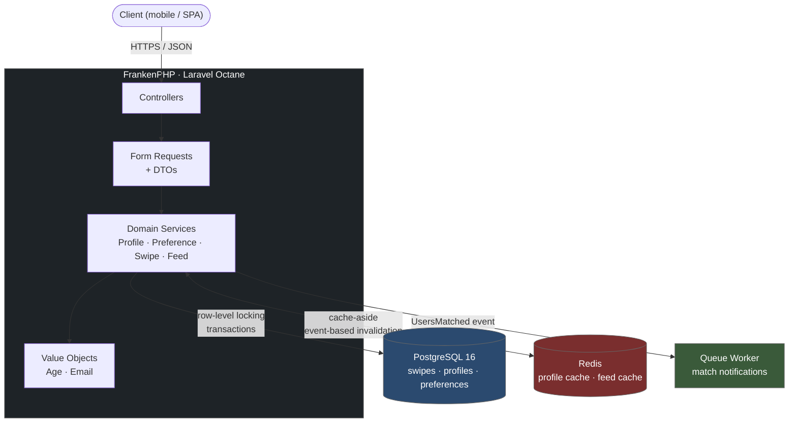

# Tinder Clone API

An API-only dating app backend built with **Laravel 13**, **PostgreSQL**, **Redis**, and **FrankenPHP (Octane)**.

---

## Architecture



**Request flow, in short:** every write goes through a Form Request → DTO → Service pipeline. Services own the transactional and locking logic; controllers stay thin. Reads that are expensive or hot (profile lookups, feed candidates) go through Redis with a cache-aside pattern - invalidated by domain events, not by scattered manual calls sprinkled across every write path.

---

## Features

- **Auth** - registration, login, email verification, password reset (Sanctum, token-based)
- **Profiles & Preferences** - DTO-driven validation, Value Objects enforcing domain invariants (`Age`, `Email`)
- **Photo uploads** - validated, storage-abstracted behind an interface (swap local disk for S3 without touching business logic), position-ordered
- **Swipes & Matching** - like/dislike with mutual-match detection that's safe under concurrent requests
- **Recommendation Feed** - cursor-paginated, symmetric preference matching, cache-aside with targeted invalidation
- **API versioning** - `routes/api/v1.php`, room to add `v2` without breaking existing clients
- **Consistent JSON envelope** - every response, success or error, follows the same shape
- **Rate limiting** - separate throttle policies for auth vs. authenticated traffic
- **Self-updating API docs** - generated from real code via `dedoc/scramble`, never hand-written, never stale

---

## Tech stack

| Layer | Choice | Why it's here |
|---|---|---|
| Runtime | PHP 8.4 + Laravel 13 | Current stack, modern language features used deliberately, not just declared in `composer.json` |
| App server | FrankenPHP (Laravel Octane) | Persistent worker mode - the framework isn't rebuilt from scratch on every request |
| Database | PostgreSQL 16 | Real constraint and transaction guarantees; isolated instance for tests |
| Cache | Redis | Cache-aside layer for the reads that actually get hit hard |
| Testing | Pest | Feature + unit coverage, with real attention on the concurrency-sensitive paths |
| Static analysis | PHPStan (Larastan, max level) | Catches what tests don't |
| Style / refactoring | Pint + Rector | Enforced style, automated upgrade checks |
| API docs | Scramble (OpenAPI 3.1) | Docs generated from actual FormRequests/Resources |

---

## Design decisions worth knowing about

The short version of the reasoning behind the pieces most likely to come up in review or conversation.

**Matching is race-safe by construction, not by luck.**
Each user pair gets exactly one row in `swipes`, with `user_id_1 < user_id_2` enforced by a `CHECK` constraint, and a `UNIQUE` constraint on the pair backing it at the storage layer. Processing a swipe reads that row with `SELECT ... FOR UPDATE` inside a transaction, so if two people swipe on each other in the same instant, the second request simply waits for the first to commit and then sees accurate state. A naive read-then-write version of this would silently drop matches under concurrency - this one can't.

**Only the side effects of a match are async.**
Push/email notifications go through a queued listener. The match determination itself stays synchronous - it's a single indexed row lookup, cheap enough that queuing it would trade correctness risk for a performance win that doesn't exist.

**The feed filters both ways, not one.**
A candidate only shows up if each user falls inside the other's stated preferences - age and gender both ways. A one-directional filter would let someone like a profile that could mathematically never like them back.

**Caching isn't one-size-fits-all.**
The profile cache is held to a strict rule: it must never diverge from the database. It's invalidated through a `UserProfileChanged` domain event dispatched with `ShouldDispatchAfterCommit`, so a cache rebuild can never run ahead of a transaction that hasn't committed yet. The feed cache, by contrast, uses a deliberately looser model - TTL-based with point invalidation on swipe - because a stale candidate in a feed costs nothing: match logic re-checks real state at swipe time regardless.

**Domain exceptions carry their own status code.**
Rather than growing a `match` statement in the global handler that someone has to remember to update every time a new business error shows up, exceptions extend a small `ApiException` base that declares its own HTTP status. The handler stays a thin, stable dispatcher instead of an allowlist that quietly 500s on anything unfamiliar.

**Built with Octane's execution model in mind, not retrofitted to it.**
Under Octane/FrankenPHP, application state persists across requests inside a worker process - singletons don't reset the way they do under PHP-FPM. Every service here is stateless (`readonly`, no mutable instance properties), which was a constraint from the start rather than a bug fixed after switching runtimes.

---

## Getting started

```bash
git clone https://github.com/leptyagin/laravel-api.git
cd laravel-api
cp .env.example .env

make build     # build images, start containers
make install   # composer install, key:generate, migrate
```

- API: `http://localhost:8085`
- Docs: `http://localhost:8085/docs/api`

```bash
make up          # start all services
make down        # stop all services
make test        # full test suite
make test-unit   # unit tests only
make test-feat   # feature tests only
make lint        # Pint + Rector
make fresh       # reset DB + reseed
make bash        # shell into the app container
```

---

## Testing

```bash
make test
```

Tests run against an isolated PostgreSQL instance, kept separate from the development database. Coverage is weighted toward the paths where correctness is actually at stake under concurrency: mutual match detection, canonical pair ordering regardless of who swipes first, cache invalidation on every write path, and symmetric feed filtering.

A quick note on concurrency testing: genuine multi-process race conditions aren't something a single PHPUnit/Pest process can honestly simulate. The match test suite checks for correct *outcomes* - order independence, no duplicate matches - rather than pretending to reproduce literal simultaneous requests. The actual safety guarantee comes from `SELECT ... FOR UPDATE` and the database constraints described above; that's a code-review claim, not a test-suite claim, and it's worth being upfront about the difference.

---

## License

MIT